# Kubernetes Ingress works with aws-alb-ingress-controller

<p align="center">
    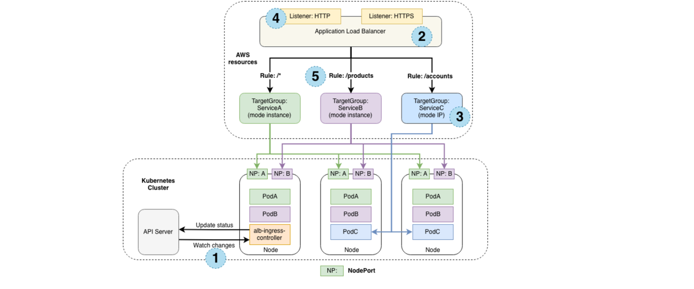
</p>

Kubernetes Ingress is an API resource that allows you manage external or internal HTTP(S) access to Kubernetes services running in a cluster. Amazon Elastic Load Balancing Application Load Balancer (ALB) is a popular AWS service that load balances incoming traffic at the application layer (layer 7) across multiple targets, such as Amazon EC2 instances, in a region. ALB supports multiple features including host or path based routing, TLS (Transport Layer Security) termination, WebSockets, HTTP/2, AWS WAF (Web Application Firewall) integration, integrated access logs, and health checks.

The open source AWS ALB Ingress controller triggers the creation of an ALB and the necessary supporting AWS resources whenever a Kubernetes user declares an Ingress resource in the cluster. The Ingress resource uses the ALB to route HTTP(S) traffic to different endpoints within the cluster. The AWS ALB Ingress controller works on any Kubernetes cluster including Amazon Elastic Kubernetes Service (Amazon EKS).

### **Terminology**
We will use the following acronyms to describe the Kubernetes Ingress concepts in more detail:

- **ALB**: AWS Application Load Balancer
- **ENI**: Elastic Network Interfaces
- **NodePort**: When a user sets the Service type field to NodePort, Kubernetes allocates a static port from a range and each worker node will proxy that same port to said Service.
- **OIDC**: OpenID Connect (OIDC) is an interoperable authentication protocol based on the OAuth 2.0 framework of specifications (IETF RFC 6749 and 6750). It simplifies the way to verify the identity of users based on the authentication performed by an Authorization Server and to obtain user profile information in an interoperable and REST-like manner. Your cluster has an OpenID Connect (OIDC) issuer URL associated with it. To use AWS Identity and Access Management (IAM) roles for service accounts, an IAM OIDC provider must exist for your cluster’s OIDC issuer URL.

## Deployment of an AWS ALB Ingress Controller with EKS

Below are the steps:
1. Create a Kubernetes cluster
2. Create and deploy AWS ALB Ingress Controller
3. Deploy sample application
4. Deploy Jenkins


### 1. Deploy Amazon EKS with eksctl

**Note: Ensure that `kubectl` and `eksctl` is installed on your computer. See the document to know [how to install kubectl and eksctl](https://docs.google.com/document/d/1DCS7z88_fWcGtL6sZDUg4_AneCCEN9ty/edit) on your local machine.**

Use the command below to create a Kubernetes cluster called my-eks-cluster in the region us-east-1 with parameters mentioned.

```bash
eksctl create cluster \
  --name my-eks-cluster \
  --region us-east-1 \
  --nodegroup-name my-nodegroup \
  --node-type t3.medium \
  --nodes 3 \
  --nodes-min 1 \
  --nodes-max 5 \
  --managed
```

Now create an IAM OIDC provider and associate it with your cluster:
```bash
eksctl utils associate-iam-oidc-provider --cluster=my-eks-cluster --approve
```

<p align="center">
    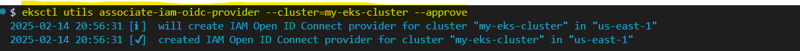
</p>

### 2. Deploy AWS ALB Ingress controller

Next, let’s deploy the AWS ALB Ingress controller into our EKS cluster using the steps below.
Give permission to Kubernetes to get access to AWS resources

```bash
kubectl apply -f https://raw.githubusercontent.com/kubernetes-sigs/aws-alb-ingress-controller/v1.1.4/docs/examples/rbac-role.yaml
```

<p align="center">
    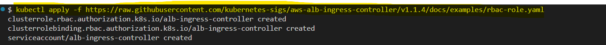
</p>

Next, create an IAM policy named `ALBIngressControllerIAMPolicy`, using the json file in the folder (`policy.json`), to allow the `ALB Ingress controller` to make AWS API calls on your behalf. Record the Policy.Arn in the command output, you will need it in the next step:


```bash
aws iam create-policy \
    --policy-name ALBIngressControllerIAMPolicy2 \
    --policy-document file://policy.json
```

<p align="center">
    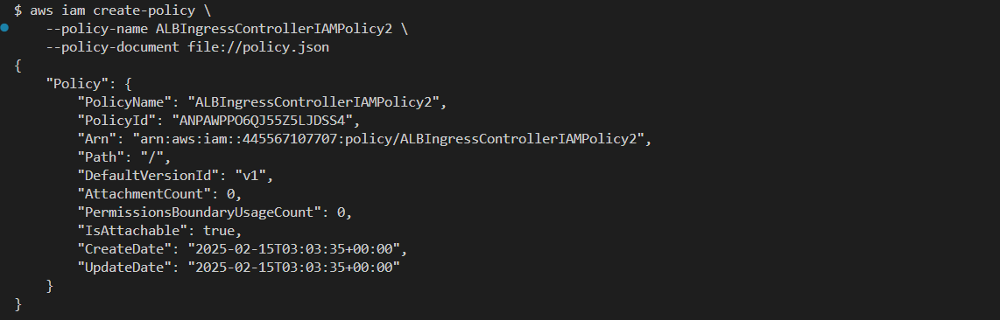
</p>

Next, create a Kubernetes service account and an IAM role (for the pod running the AWS ALB Ingress controller) by substituting $PolicyARN with the recorded value from the previous step:

```bash
eksctl create iamserviceaccount \
       --cluster=my-eks-cluster \
       --namespace=kube-system \
       --name=alb-ingress-controller \
       --attach-policy-arn=$PolicyARN \
       --override-existing-serviceaccounts \
       --approve
```

<p align="center">
    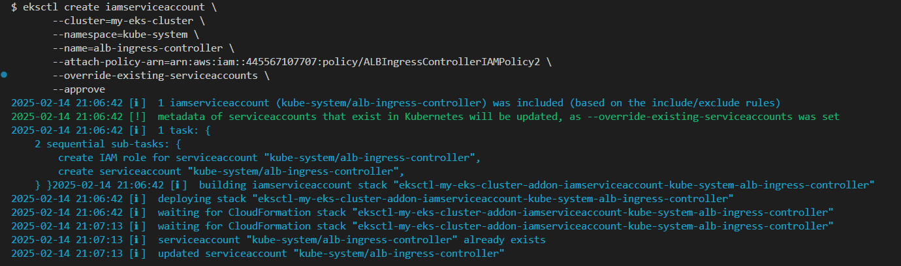
</p>


Then deploy the AWS ALB Ingress controller:

```bash
curl -sS "https://raw.githubusercontent.com/kubernetes-sigs/aws-alb-ingress-controller/v1.1.4/docs/examples/alb-ingress-controller.yaml" \
     | sed "s/# - --cluster-name=devCluster/- --cluster-name=my-eks-cluster/g" \
     | kubectl apply -f -
```

<p align="center">
    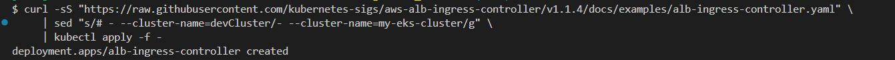
</p>

Finally, verify that the deployment was successful and the controller started:

```bash
 kubectl logs -n kube-system $(kubectl get po -n kube-system | egrep -o alb-ingress[a-zA-Z0-9-]+)
```

<p align="center">
    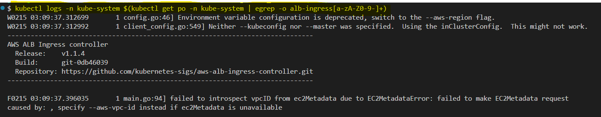
</p>

### 3. Deploy sample application (2048-Game)

Now let’s deploy a sample 2048 game into our Kubernetes cluster and use the Ingress resource to expose it to traffic.

- Deploy 2048 game resources:

```bash
kubectl apply -f 2048-namespace.yaml
kubectl apply -f 2048-deployment.yaml
kubectl apply -f 2048-service.yaml
```

<p align="center">
    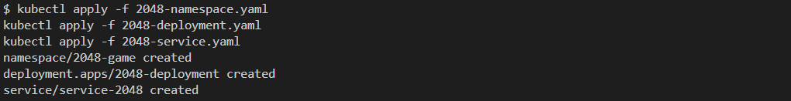
</p>

- Deploy an Ingress resource for the 2048 game

```bash
kubectl apply -f 2048-ingress.yaml
```

<p align="center">
    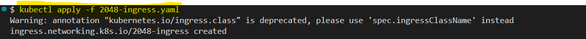
</p>

After few seconds, verify that the Ingress resource is enabled:

<p align="center">
    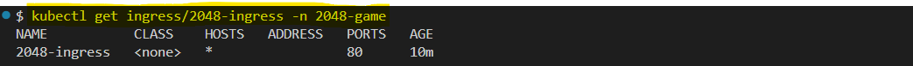
</p>

- Update the Security group on AWS EC2 Dashboard to allow traffic on port 30000 corresponding to the nodePort
    - Open your AWS EC2 Dashboard and select one the Nodes
    - Then Select Security Tab
    - Scroll down to Inbound rules and updates the Inbound rules of the two security groups identified by the link, by adding a rule to traffic on port 30000

<p align="center">
    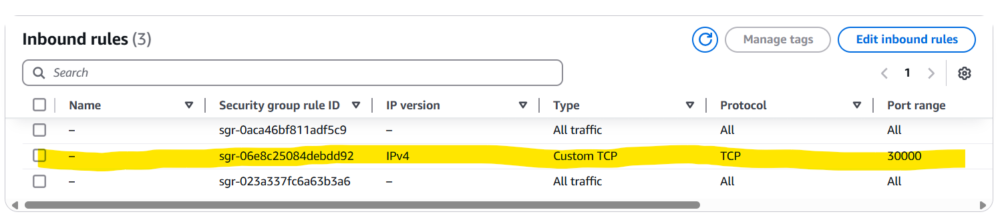
</p>

- Open your web browser and use the Public IP of one othe instances with the port `30000`.

<p align="center">
    
</p>

## Deployment of Jenkins with Ingress Controller
1. Create a NameSpace called `jenkins-ns`
```bash
kubectl apply -f jenkins-storage.yaml
```

<p align="center">
    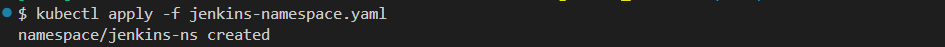
</p>

2. Create StorageClass

```bash
kubectl apply -f jenkins-storage.yaml
```

### Cleanp

